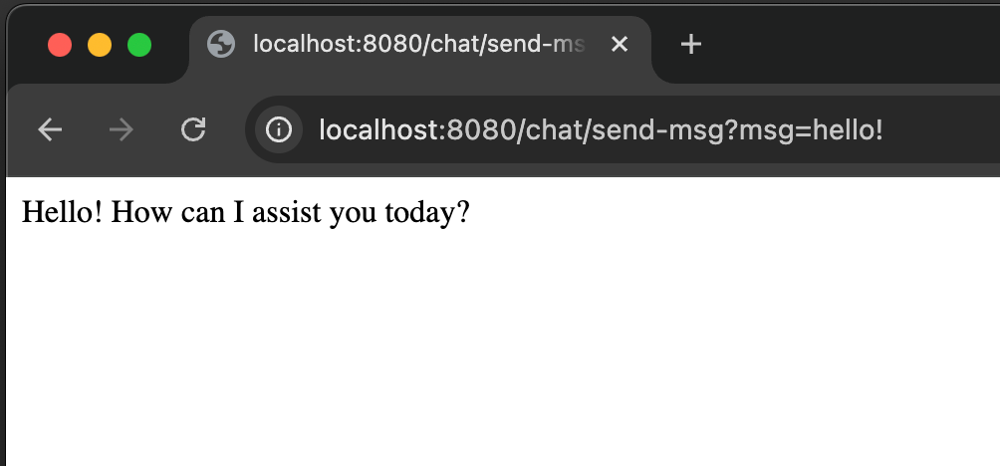

# Java Spring AI integration with Ollama in local machine

This repository contains a simple Java Spring application that sends messages to the Ollama chatbot and gets a response.

How to Install Ollama
1.	Download the Ollama installer from the official website and run the installer.
2.  Run ```ollama run llama3.2``` (3.2 is an example, see your version first) - Now you can access the ollama through the command line.
3.  Clone this repository and run the Spring Boot application ````mvn spring-boot:run````
4.  Make a GET request to the endpoint ```/chat/send-msg?msg=your_message_here``` to send a message to the chatbot.

Example:
````
GET: http://localhost:8080/chat/send-msg?msg=hello!
````

The response will be the chatbot’s reply:




That’s it! You can now send messages to Ollama using the Spring Boot application, this is a start point to integrate AI in your Java applications.